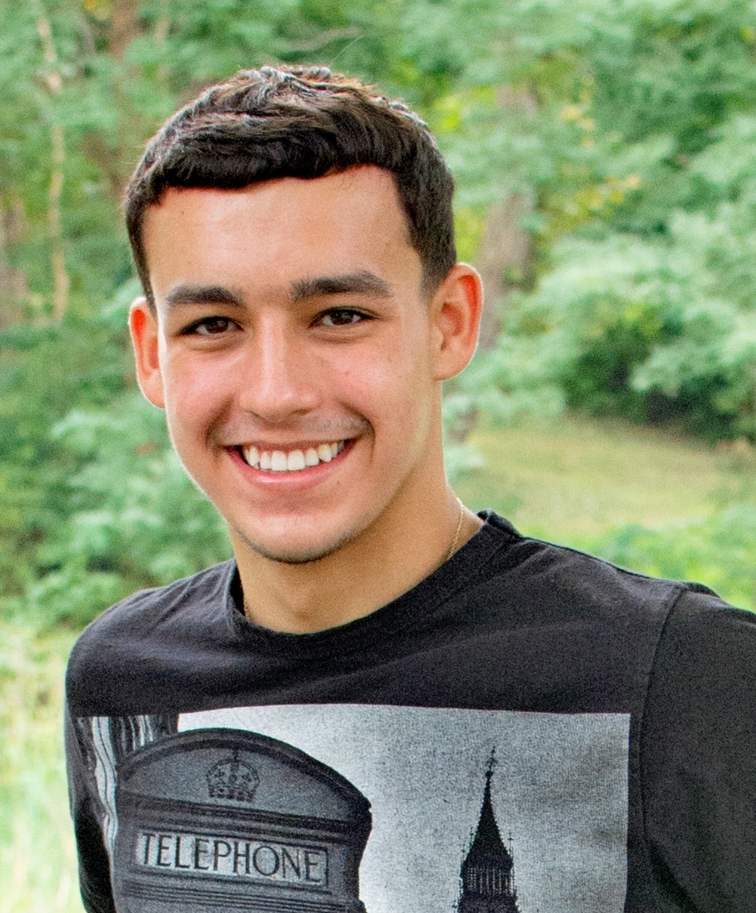

# Open Source Software - Summer 2019
## Dylan Kullas

## Bio

### Name: Dylan Kullas (Kullad)

### email: Kullad@rpi.edu 

### github account: Kullas233

### discord handle: Kullas233

### slack handle: Kullad
I am a Junior majoring in computer science and plan to minor in Cognitive Science. I have experience with Java, Python, C,  and C++. I also have some experience with SQL, HTML/CSS/Javascript, and C#. I was an intern at General Dynamics this past fall which gave me experience in Powershell and networking as well.

## Lab Reports
[Lab 1](labs/lab-01/report.md)
