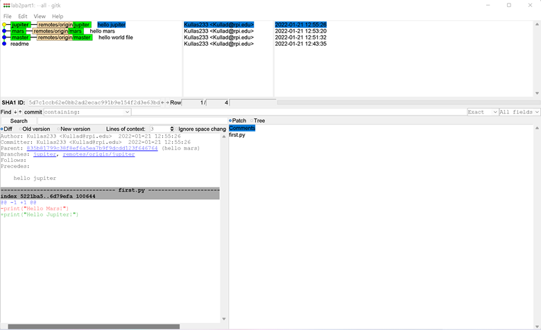
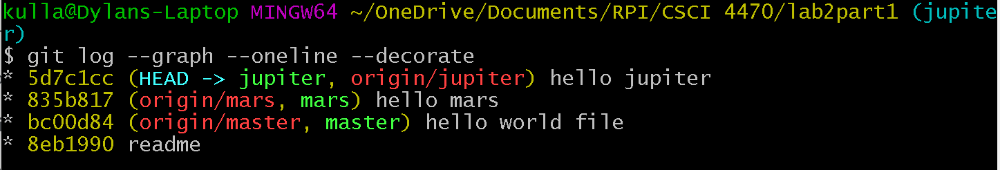
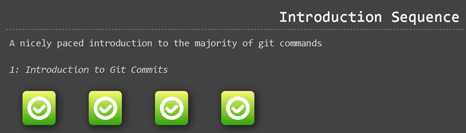
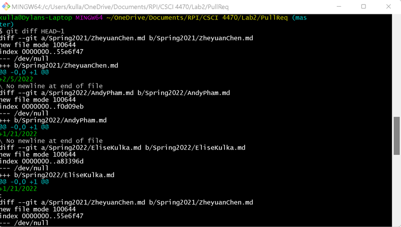
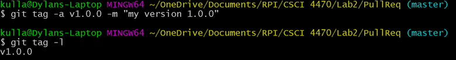

# Lab 02 Report - Git
## Part 1
Link to lab2part1 repo: https://github.com/Kullas233/lab2part1

gitk –all  

git log --graph --oneline --decorate  

## Part 2
Link to forked Spoon-Knife repo: https://github.com/Kullas233/Spoon-Knife

Learn Git Branching  

## Part 3
Link to forked PullReq repo: https://github.com/Kullas233/PullReq

git diff HEAD~1  

git tag -L  

Link to table's project idea repo: https://github.com/vandek5/OSSProjectIdeas
