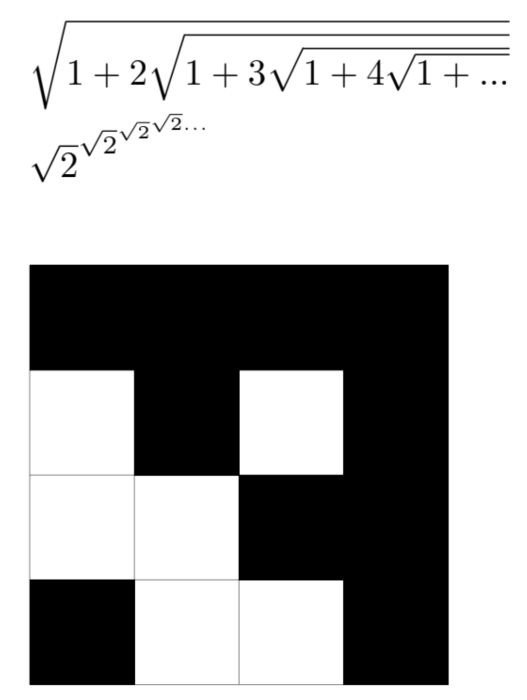

# Lab 03 Report - Documentation and Community Development
## Part 1 - Documentation
### Project Wiki
Link to Project Wiki: https://github.com/Kullas233/oss-repo-template/wiki/Project

### Latex
$\sqrt{1+2\sqrt{1+3\sqrt{1+4\sqrt{1+...}}}}$  
\newline  
$\sqrt{2}^{\sqrt{2}^{\sqrt{2}^{\sqrt{2}...}}}$  
\newline  
  
\usepackage{tikz}  
\begin{tikzpicture}  
\draw[step=1cm,gray,very thin] (0,0) grid (4,4);  
\fill[black] (0,3) rectangle (4,4);  
\fill[black] (1,2) rectangle (2,3);  
\fill[black] (3,0) rectangle (4,3);  
\fill[black] (2,1) rectangle (3,2);  
\fill[black] (0,0) rectangle (1,1);  
\end{tikzpicture}  

## Part 2 - Community
