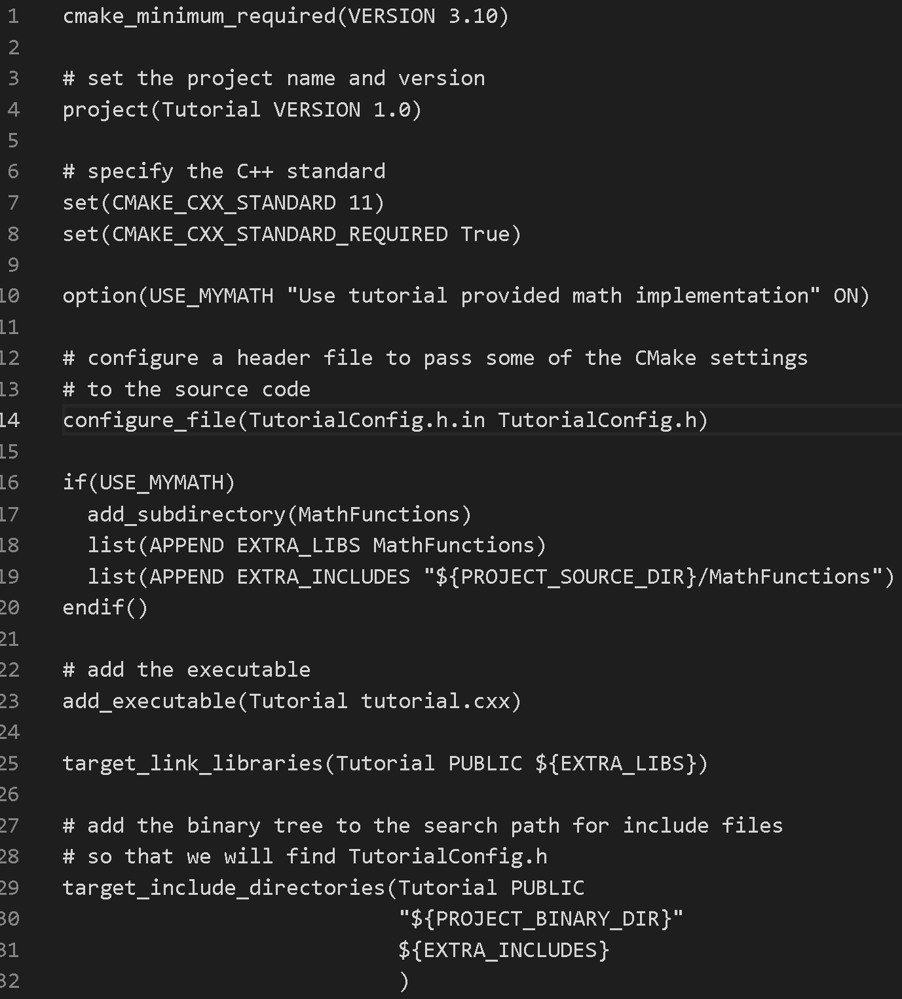
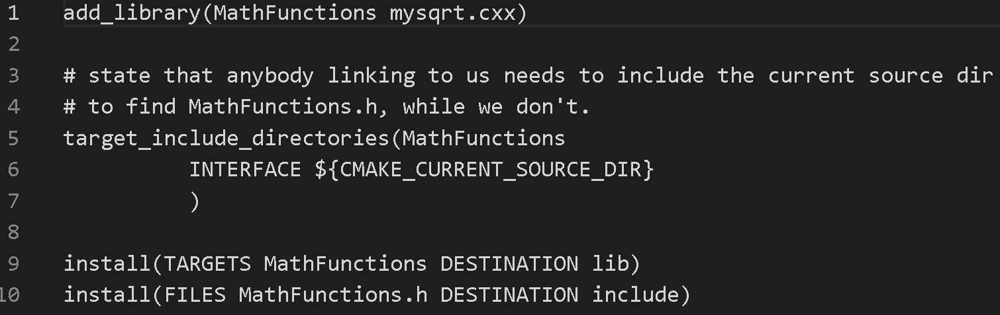

# Lab 05 Report - Build Systems
## CMake Tutorial
### Step 1

### Step 2

### Step 3

### Step 4

UpdateCTestConfiguration  from :/mnt/c/Users/kulla/OneDrive/Documents/RPI/CSCI 4470/cmake/help/guide/tutorial/step4_build/DartConfiguration.tcl  
UpdateCTestConfiguration  from :/mnt/c/Users/kulla/OneDrive/Documents/RPI/CSCI 4470/cmake/help/guide/tutorial/step4_build/DartConfiguration.tcl  
Test project /mnt/c/Users/kulla/OneDrive/Documents/RPI/CSCI 4470/cmake/help/guide/tutorial/step4_build  
Constructing a list of tests  
Done constructing a list of tests  
Updating test list for fixtures  
Added 0 tests to meet fixture requirements  
Checking test dependency graph...  
Checking test dependency graph end  
test 1  
    Start 1: Runs  
  
1: Test command: /mnt/c/Users/kulla/OneDrive/Documents/RPI/CSCI\ 4470/cmake/Help/guide/tutorial/Step4_build/Tutorial "25"  
1: Test timeout computed to be: 9.99988e+06  
1: Computing sqrt of 25 to be 13  
1: Computing sqrt of 25 to be 7.46154  
1: Computing sqrt of 25 to be 5.40603  
1: Computing sqrt of 25 to be 5.01525  
1: Computing sqrt of 25 to be 5.00002  
1: Computing sqrt of 25 to be 5  
1: Computing sqrt of 25 to be 5  
1: Computing sqrt of 25 to be 5  
1: Computing sqrt of 25 to be 5  
1: Computing sqrt of 25 to be 5  
1: The square root of 25 is 5  
1/9 Test #1: Runs .............................   Passed    0.02 sec  
test 2  
    Start 2: Usage  
  
2: Test command: /mnt/c/Users/kulla/OneDrive/Documents/RPI/CSCI\ 4470/cmake/Help/guide/tutorial/Step4_build/Tutorial  
2: Test timeout computed to be: 9.99988e+06  
2: /mnt/c/Users/kulla/OneDrive/Documents/RPI/CSCI 4470/cmake/Help/guide/tutorial/Step4_build/Tutorial Version 1.0  
2: Usage: /mnt/c/Users/kulla/OneDrive/Documents/RPI/CSCI 4470/cmake/Help/guide/tutorial/Step4_build/Tutorial number  
2/9 Test #2: Usage ............................   Passed    0.01 sec  
test 3  
    Start 3: Comp4  
  
3: Test command: /mnt/c/Users/kulla/OneDrive/Documents/RPI/CSCI\ 4470/cmake/Help/guide/tutorial/Step4_build/Tutorial "4"  
3: Test timeout computed to be: 9.99988e+06  
3: Computing sqrt of 4 to be 2.5  
3: Computing sqrt of 4 to be 2.05  
3: Computing sqrt of 4 to be 2.00061  
3: Computing sqrt of 4 to be 2  
3: Computing sqrt of 4 to be 2  
3: Computing sqrt of 4 to be 2  
3: Computing sqrt of 4 to be 2  
3: Computing sqrt of 4 to be 2  
3: Computing sqrt of 4 to be 2  
3: Computing sqrt of 4 to be 2  
3: The square root of 4 is 2  
3/9 Test #3: Comp4 ............................   Passed    0.01 sec  
test 4  
    Start 4: Comp9  
  
4: Test command: /mnt/c/Users/kulla/OneDrive/Documents/RPI/CSCI\ 4470/cmake/Help/guide/tutorial/Step4_build/Tutorial "9"  
4: Test timeout computed to be: 9.99988e+06  
4: Computing sqrt of 9 to be 5  
4: Computing sqrt of 9 to be 3.4  
4: Computing sqrt of 9 to be 3.02353  
4: Computing sqrt of 9 to be 3.00009  
4: Computing sqrt of 9 to be 3  
4: Computing sqrt of 9 to be 3  
4: Computing sqrt of 9 to be 3  
4: Computing sqrt of 9 to be 3  
4: Computing sqrt of 9 to be 3  
4: Computing sqrt of 9 to be 3  
4: The square root of 9 is 3  
4/9 Test #4: Comp9 ............................   Passed    0.02 sec  
test 5  
    Start 5: Comp5  
  
5: Test command: /mnt/c/Users/kulla/OneDrive/Documents/RPI/CSCI\ 4470/cmake/Help/guide/tutorial/Step4_build/Tutorial "5"  
5: Test timeout computed to be: 9.99988e+06  
5: Computing sqrt of 5 to be 3  
5: Computing sqrt of 5 to be 2.33333  
5: Computing sqrt of 5 to be 2.2381  
5: Computing sqrt of 5 to be 2.23607  
5: Computing sqrt of 5 to be 2.23607  
5: Computing sqrt of 5 to be 2.23607  
5: Computing sqrt of 5 to be 2.23607  
5: Computing sqrt of 5 to be 2.23607  
5: Computing sqrt of 5 to be 2.23607  
5: Computing sqrt of 5 to be 2.23607  
5: The square root of 5 is 2.23607  
5/9 Test #5: Comp5 ............................   Passed    0.01 sec  
test 6  
    Start 6: Comp7  
  
6: Test command: /mnt/c/Users/kulla/OneDrive/Documents/RPI/CSCI\ 4470/cmake/Help/guide/tutorial/Step4_build/Tutorial "7"  
6: Test timeout computed to be: 9.99988e+06  
6: Computing sqrt of 7 to be 4  
6: Computing sqrt of 7 to be 2.875  
6: Computing sqrt of 7 to be 2.65489  
6: Computing sqrt of 7 to be 2.64577  
6: Computing sqrt of 7 to be 2.64575  
6: Computing sqrt of 7 to be 2.64575  
6: Computing sqrt of 7 to be 2.64575  
6: Computing sqrt of 7 to be 2.64575  
6: Computing sqrt of 7 to be 2.64575  
6: Computing sqrt of 7 to be 2.64575  
6: The square root of 7 is 2.64575  
6/9 Test #6: Comp7 ............................   Passed    0.02 sec  
test 7  
    Start 7: Comp25  
  
7: Test command: /mnt/c/Users/kulla/OneDrive/Documents/RPI/CSCI\ 4470/cmake/Help/guide/tutorial/Step4_build/Tutorial "25"  
7: Test timeout computed to be: 9.99988e+06  
7: Computing sqrt of 25 to be 13  
7: Computing sqrt of 25 to be 7.46154  
7: Computing sqrt of 25 to be 5.40603  
7: Computing sqrt of 25 to be 5.01525  
7: Computing sqrt of 25 to be 5.00002  
7: Computing sqrt of 25 to be 5  
7: Computing sqrt of 25 to be 5  
7: Computing sqrt of 25 to be 5  
7: Computing sqrt of 25 to be 5  
7: Computing sqrt of 25 to be 5  
7: The square root of 25 is 5  
7/9 Test #7: Comp25 ...........................   Passed    0.02 sec  
test 8  
    Start 8: Comp-25  
  
8: Test command: /mnt/c/Users/kulla/OneDrive/Documents/RPI/CSCI\ 4470/cmake/Help/guide/tutorial/Step4_build/Tutorial "-25"  
8: Test timeout computed to be: 9.99988e+06  
8: The square root of -25 is 0  
8/9 Test #8: Comp-25 ..........................   Passed    0.02 sec  
test 9  
    Start 9: Comp0.0001  
  
9: Test command: /mnt/c/Users/kulla/OneDrive/Documents/RPI/CSCI\ 4470/cmake/Help/guide/tutorial/Step4_build/Tutorial "0.0001"  
9: Test timeout computed to be: 9.99988e+06  
9: Computing sqrt of 0.0001 to be 0.50005  
9: Computing sqrt of 0.0001 to be 0.250125  
9: Computing sqrt of 0.0001 to be 0.125262  
9: Computing sqrt of 0.0001 to be 0.0630304  
9: Computing sqrt of 0.0001 to be 0.0323084  
9: Computing sqrt of 0.0001 to be 0.0177018  
9: Computing sqrt of 0.0001 to be 0.0116755  
9: Computing sqrt of 0.0001 to be 0.0101202  
9: Computing sqrt of 0.0001 to be 0.0100007  
9: Computing sqrt of 0.0001 to be 0.01  
9: The square root of 0.0001 is 0.01  
9/9 Test #9: Comp0.0001 .......................   Passed    0.02 sec  
  
100% tests passed, 0 tests failed out of 9  
### Step 5

## MakeFile
### My Makefile
#makes both instead of just first
all: program programd

#creates program with static
program: program.o libstatic_block.a
	cc -lm -o program program.o -L. -lstatic_block

#creates programd with shared
programd: program.o libdynamic_block.so
	gcc -L. -Wl,-rpath=. -Wall -o programd program.c -ldynamic_block

#program
program.o: program.c headers/block.h
	cc -c program.c -o program.o

#compiles block
block.o: source/block.c headers/block.h
	cc -c source/block.c

#creates static library
libstatic_block.a: source/block.o
	ar rcs libstatic_block.a source/block.o

#creates shared library
libdynamic_block.so: source/block.c headers/block.h
	gcc source/block.c -o libdynamic_block.so -fPIC -shared

### My CMakeLists.txt
cmake_minimum_required(VERSION 3.10)

#set the project name and version
project(Program VERSION 1.0)

#specify the C++ standard
set(CMAKE_CXX_STANDARD 11)
set(CMAKE_CXX_STANDARD_REQUIRED True)

include_directories(${CMAKE_CURRENT_SOURCE_DIR}/source)
add_library(static_block STATIC source/block.c)
add_library(dynamic_block SHARED source/block.c)

add_executable(static_blockP program.c)
target_link_libraries(static_blockP static_block)
target_include_directories(static_blockP PUBLIC
                           "${PROJECT_BINARY_DIR}"
                           ${EXTRA_INCLUDES}
                           )

add_executable(dynamic_blockP program.c)
target_link_libraries(dynamic_blockP dynamic_block)
target_include_directories(dynamic_blockP PUBLIC
                           "${PROJECT_BINARY_DIR}"
                           ${EXTRA_INCLUDES}
                           )

### CMake's Makefile
#CMAKE generated file: DO NOT EDIT!
#Generated by "Unix Makefiles" Generator, CMake Version 3.10

#Default target executed when no arguments are given to make.
default_target: all

.PHONY : default_target

#Allow only one "make -f Makefile2" at a time, but pass parallelism.
.NOTPARALLEL:

#=============================================================================
#Special targets provided by cmake.

#Disable implicit rules so canonical targets will work.
.SUFFIXES:

#Remove some rules from gmake that .SUFFIXES does not remove.
SUFFIXES =

.SUFFIXES: .hpux_make_needs_suffix_list

#Suppress display of executed commands.
$(VERBOSE).SILENT:

# A target that is always out of date.
cmake_force:

.PHONY : cmake_force

#=============================================================================
# Set environment variables for the build.

# The shell in which to execute make rules.
SHELL = /bin/sh

# The CMake executable.
CMAKE_COMMAND = /usr/bin/cmake

# The command to remove a file.
RM = /usr/bin/cmake -E remove -f

# Escaping for special characters.
EQUALS = =

# The top-level source directory on which CMake was run.
CMAKE_SOURCE_DIR = "/mnt/c/Users/kulla/OneDrive/Documents/RPI/CSCI 4470/CSCI-4470-OpenSource/Modules/05.BuildSystems/Lab-BuildSystemsExample"

# The top-level build directory on which CMake was run.
CMAKE_BINARY_DIR = "/mnt/c/Users/kulla/OneDrive/Documents/RPI/CSCI 4470/CSCI-4470-OpenSource/Modules/05.BuildSystems/build"

#=============================================================================
# Targets provided globally by CMake.

# Special rule for the target rebuild_cache
rebuild_cache:
	@$(CMAKE_COMMAND) -E cmake_echo_color --switch=$(COLOR) --cyan "Running CMake to regenerate build system..."
	/usr/bin/cmake -H$(CMAKE_SOURCE_DIR) -B$(CMAKE_BINARY_DIR)
.PHONY : rebuild_cache

#Special rule for the target rebuild_cache
rebuild_cache/fast: rebuild_cache

.PHONY : rebuild_cache/fast

#Special rule for the target edit_cache
edit_cache:
	@$(CMAKE_COMMAND) -E cmake_echo_color --switch=$(COLOR) --cyan "No interactive CMake dialog available..."
	/usr/bin/cmake -E echo No\ interactive\ CMake\ dialog\ available.
.PHONY : edit_cache

#Special rule for the target edit_cache
edit_cache/fast: edit_cache

.PHONY : edit_cache/fast

#The main all target
all: cmake_check_build_system
	$(CMAKE_COMMAND) -E cmake_progress_start "/mnt/c/Users/kulla/OneDrive/Documents/RPI/CSCI 4470/CSCI-4470-OpenSource/Modules/05.BuildSystems/build/CMakeFiles" "/mnt/c/Users/kulla/OneDrive/Documents/RPI/CSCI 4470/CSCI-4470-OpenSource/Modules/05.BuildSystems/build/CMakeFiles/progress.marks"
	$(MAKE) -f CMakeFiles/Makefile2 all
	$(CMAKE_COMMAND) -E cmake_progress_start "/mnt/c/Users/kulla/OneDrive/Documents/RPI/CSCI 4470/CSCI-4470-OpenSource/Modules/05.BuildSystems/build/CMakeFiles" 0
.PHONY : all

#The main clean target
clean:
	$(MAKE) -f CMakeFiles/Makefile2 clean
.PHONY : clean

#The main clean target
clean/fast: clean

.PHONY : clean/fast

#Prepare targets for installation.
preinstall: all
	$(MAKE) -f CMakeFiles/Makefile2 preinstall
.PHONY : preinstall

#Prepare targets for installation.
preinstall/fast:
	$(MAKE) -f CMakeFiles/Makefile2 preinstall
.PHONY : preinstall/fast

#clear depends
depend:
	$(CMAKE_COMMAND) -H$(CMAKE_SOURCE_DIR) -B$(CMAKE_BINARY_DIR) --check-build-system CMakeFiles/Makefile.cmake 1
.PHONY : depend

#=============================================================================
#Target rules for targets named dynamic_blockP

#Build rule for target.
dynamic_blockP: cmake_check_build_system
	$(MAKE) -f CMakeFiles/Makefile2 dynamic_blockP
.PHONY : dynamic_blockP

#fast build rule for target.
dynamic_blockP/fast:
	$(MAKE) -f CMakeFiles/dynamic_blockP.dir/build.make CMakeFiles/dynamic_blockP.dir/build
.PHONY : dynamic_blockP/fast

#=============================================================================
#Target rules for targets named static_blockP

#Build rule for target.
static_blockP: cmake_check_build_system
	$(MAKE) -f CMakeFiles/Makefile2 static_blockP
.PHONY : static_blockP

#fast build rule for target.
static_blockP/fast:
	$(MAKE) -f CMakeFiles/static_blockP.dir/build.make CMakeFiles/static_blockP.dir/build
.PHONY : static_blockP/fast

#=============================================================================
#Target rules for targets named static_block

#Build rule for target.
static_block: cmake_check_build_system
	$(MAKE) -f CMakeFiles/Makefile2 static_block
.PHONY : static_block

#fast build rule for target.
static_block/fast:
	$(MAKE) -f CMakeFiles/static_block.dir/build.make CMakeFiles/static_block.dir/build
.PHONY : static_block/fast

#=============================================================================
#Target rules for targets named dynamic_block

#Build rule for target.
dynamic_block: cmake_check_build_system
	$(MAKE) -f CMakeFiles/Makefile2 dynamic_block
.PHONY : dynamic_block

#fast build rule for target.
dynamic_block/fast:
	$(MAKE) -f CMakeFiles/dynamic_block.dir/build.make CMakeFiles/dynamic_block.dir/build
.PHONY : dynamic_block/fast

program.o: program.c.o

.PHONY : program.o

#target to build an object file
program.c.o:
	$(MAKE) -f CMakeFiles/dynamic_blockP.dir/build.make CMakeFiles/dynamic_blockP.dir/program.c.o
	$(MAKE) -f CMakeFiles/static_blockP.dir/build.make CMakeFiles/static_blockP.dir/program.c.o
.PHONY : program.c.o

program.i: program.c.i

.PHONY : program.i

#target to preprocess a source file
program.c.i:
	$(MAKE) -f CMakeFiles/dynamic_blockP.dir/build.make CMakeFiles/dynamic_blockP.dir/program.c.i
	$(MAKE) -f CMakeFiles/static_blockP.dir/build.make CMakeFiles/static_blockP.dir/program.c.i
.PHONY : program.c.i

program.s: program.c.s

.PHONY : program.s

#target to generate assembly for a file
program.c.s:
	$(MAKE) -f CMakeFiles/dynamic_blockP.dir/build.make CMakeFiles/dynamic_blockP.dir/program.c.s
	$(MAKE) -f CMakeFiles/static_blockP.dir/build.make CMakeFiles/static_blockP.dir/program.c.s
.PHONY : program.c.s

source/block.o: source/block.c.o

.PHONY : source/block.o

#target to build an object file
source/block.c.o:
	$(MAKE) -f CMakeFiles/static_block.dir/build.make CMakeFiles/static_block.dir/source/block.c.o
	$(MAKE) -f CMakeFiles/dynamic_block.dir/build.make CMakeFiles/dynamic_block.dir/source/block.c.o
.PHONY : source/block.c.o

source/block.i: source/block.c.i

.PHONY : source/block.i

#target to preprocess a source file
source/block.c.i:
	$(MAKE) -f CMakeFiles/static_block.dir/build.make CMakeFiles/static_block.dir/source/block.c.i
	$(MAKE) -f CMakeFiles/dynamic_block.dir/build.make CMakeFiles/dynamic_block.dir/source/block.c.i
.PHONY : source/block.c.i

source/block.s: source/block.c.s

.PHONY : source/block.s

#target to generate assembly for a file
source/block.c.s:
	$(MAKE) -f CMakeFiles/static_block.dir/build.make CMakeFiles/static_block.dir/source/block.c.s
	$(MAKE) -f CMakeFiles/dynamic_block.dir/build.make CMakeFiles/dynamic_block.dir/source/block.c.s
.PHONY : source/block.c.s

#Help Target
help:
	@echo "The following are some of the valid targets for this Makefile:"
	@echo "... all (the default if no target is provided)"
	@echo "... clean"
	@echo "... depend"
	@echo "... rebuild_cache"
	@echo "... dynamic_blockP"
	@echo "... static_blockP"
	@echo "... static_block"
	@echo "... edit_cache"
	@echo "... dynamic_block"
	@echo "... program.o"
	@echo "... program.i"
	@echo "... program.s"
	@echo "... source/block.o"
	@echo "... source/block.i"
	@echo "... source/block.s"
.PHONY : help

#=============================================================================
#Special targets to cleanup operation of make.

#Special rule to run CMake to check the build system integrity.
#No rule that depends on this can have commands that come from listfiles
#because they might be regenerated.
cmake_check_build_system:
	$(CMAKE_COMMAND) -H$(CMAKE_SOURCE_DIR) -B$(CMAKE_BINARY_DIR) --check-build-system CMakeFiles/Makefile.cmake 0
.PHONY : cmake_check_build_system

### Relative Sizes
The size of the static library program is 8464 while the shared library program is 8296.

### Running

