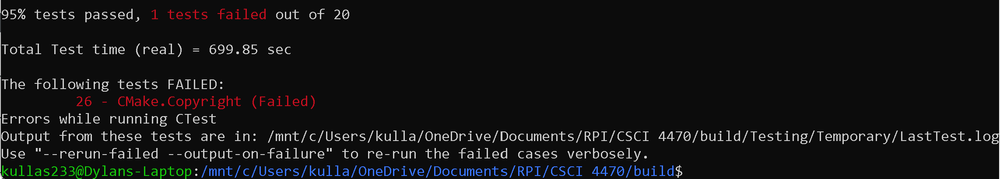

# Lab 08 Report - Testing and Continuous Integration
## Checkpoint 1: Getting Started

## Checkpoint 2: Executing the Tests
????????????????????????QUESTIONS??????????????????????????????????

## Checkpoint 3: Failing/Passing a Test

## Checkpoint 4: CI/CD

