# Lab 10 Report - Database Lab
## Checkpoint 0: Project Updates
Link to blog update: https://github.com/Kullas233/oss-repo-template/wiki/Group-Project-Weekly-Update

## Checkpoint 1: Install CouchDB
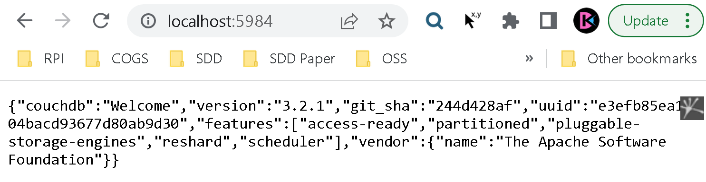

## Checkpoint 2: Quick Tour
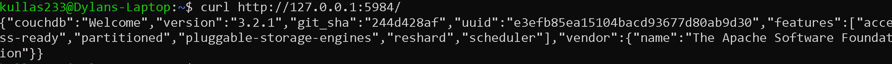
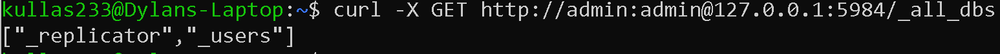
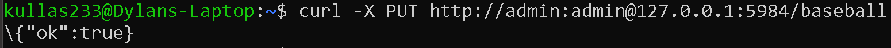
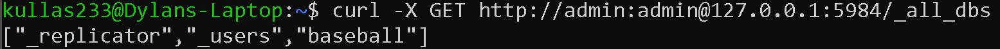
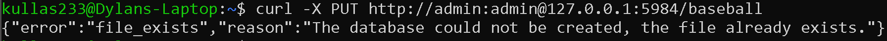
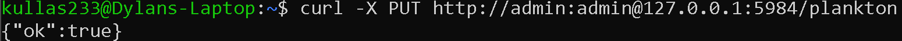
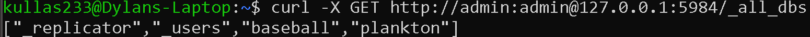

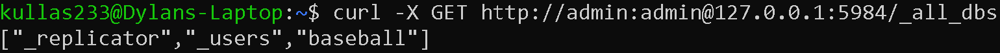
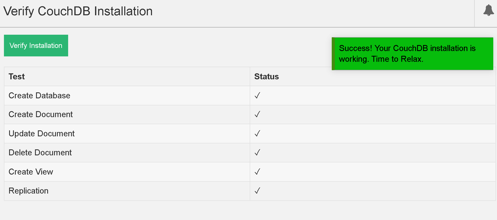

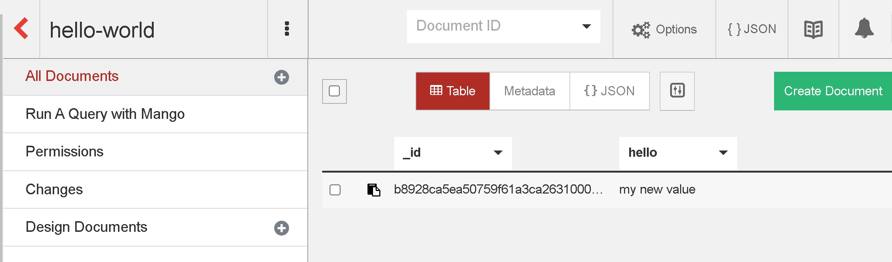
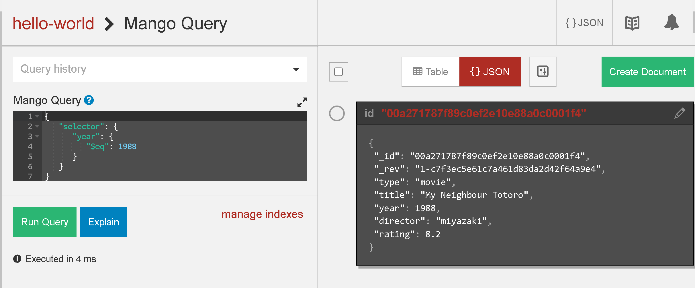
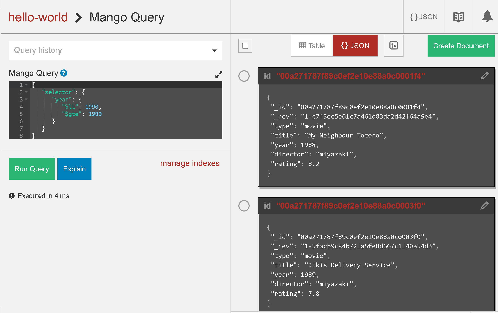
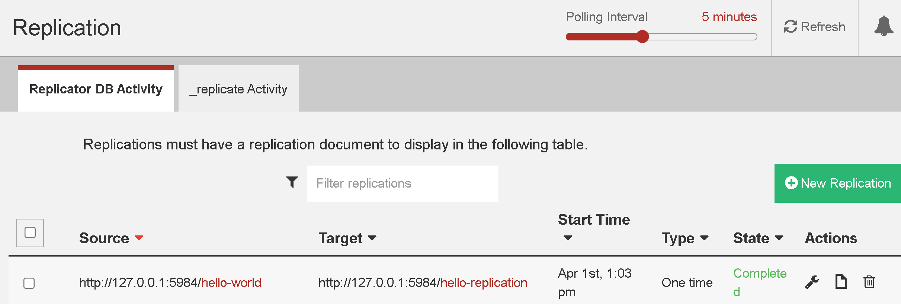

## Checkpoint 3: Now Complete the API Tutorial

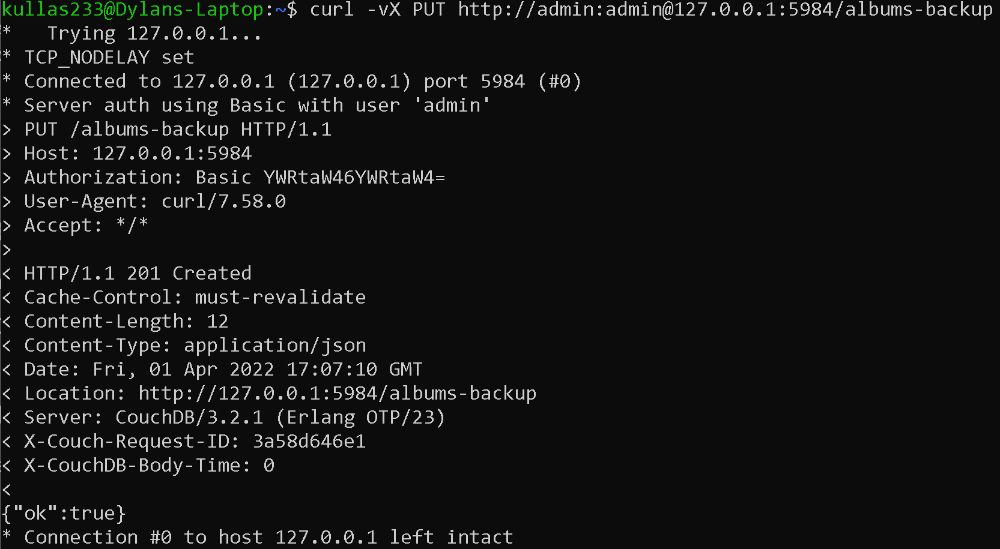

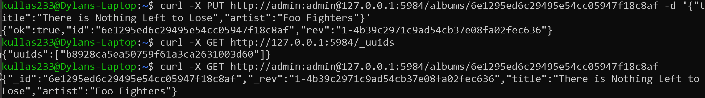
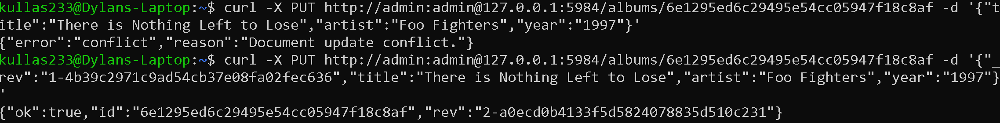
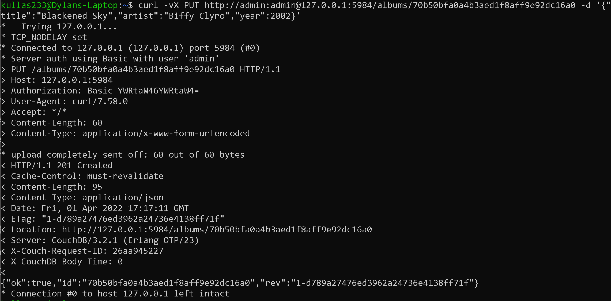
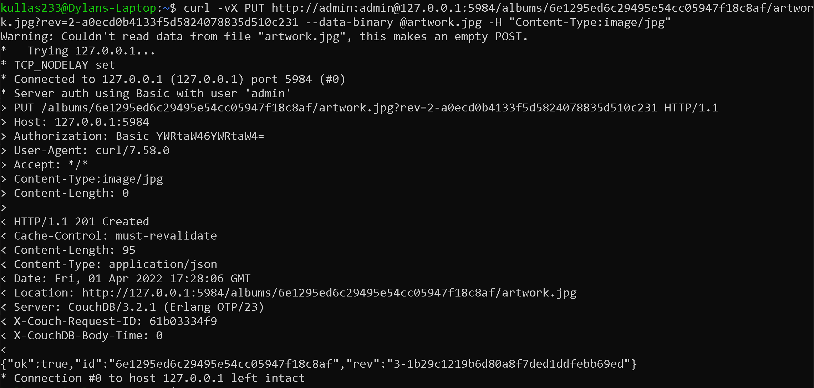
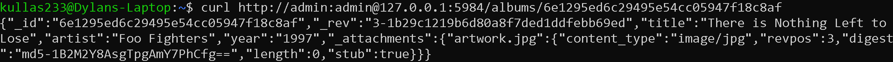
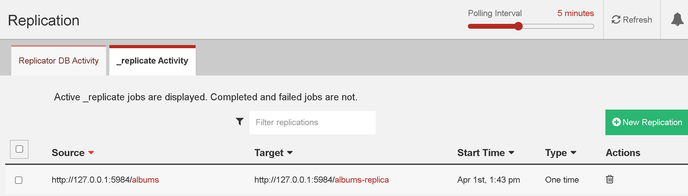
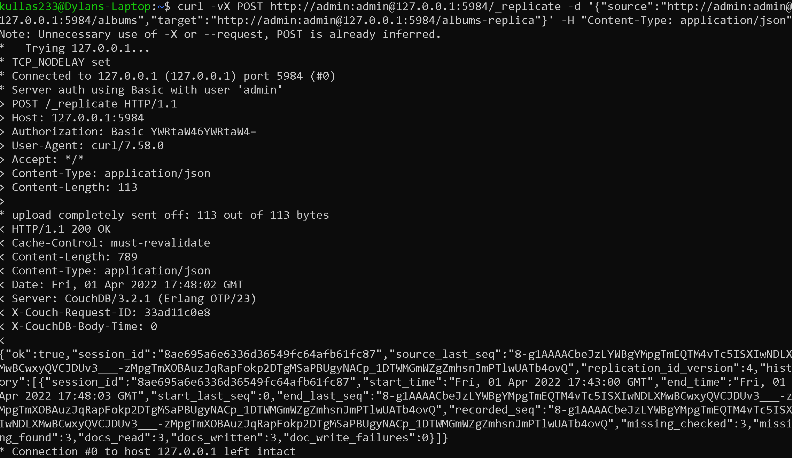

## Checkpoint 4: What Did We Miss?
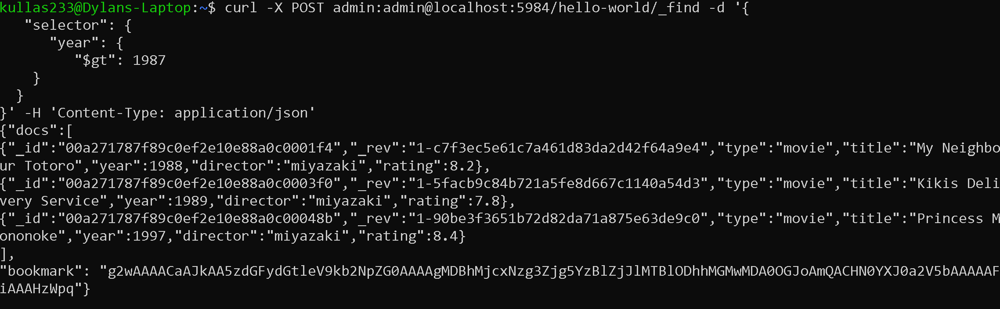
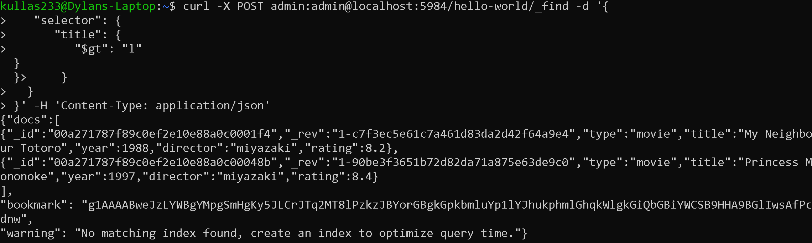

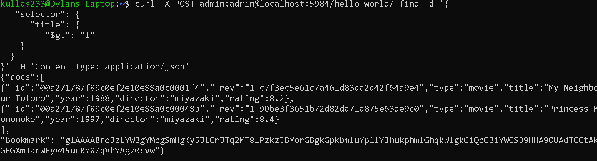