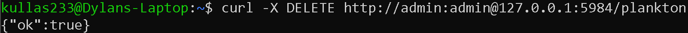
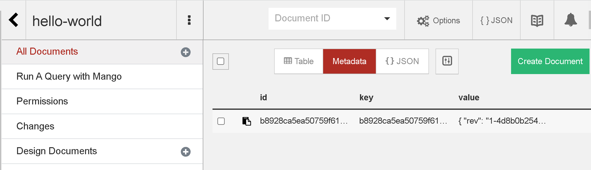
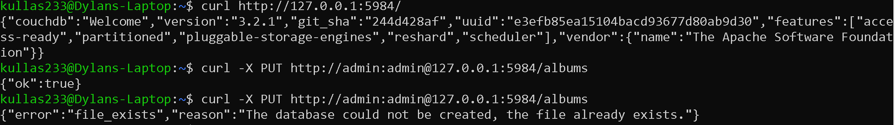
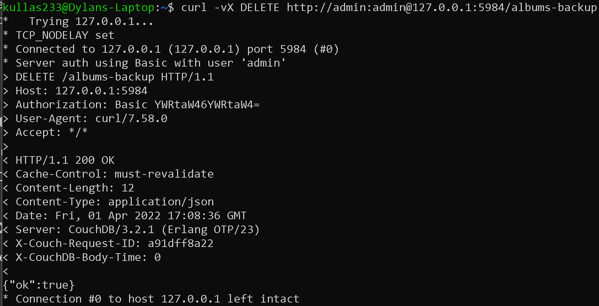
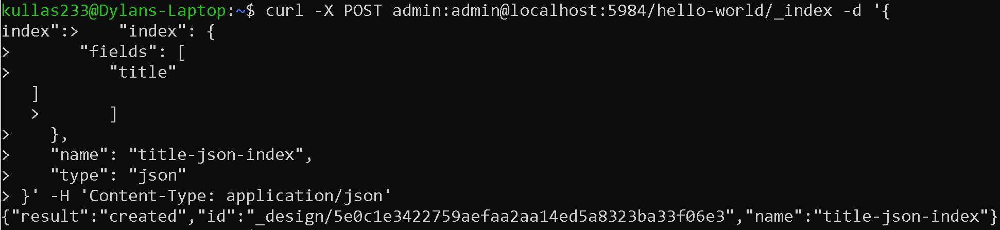

# Lab 10 Report - Database Lab
## Checkpoint 0: Project Updates
Link to blog update: https://github.com/Kullas233/oss-repo-template/wiki/Group-Project-Weekly-Update

## Checkpoint 1: Install CouchDB

## Checkpoint 2: Quick Tour

## Checkpoint 3: Now Complete the API Tutorial

## Checkpoint 4: What Did We Miss?

