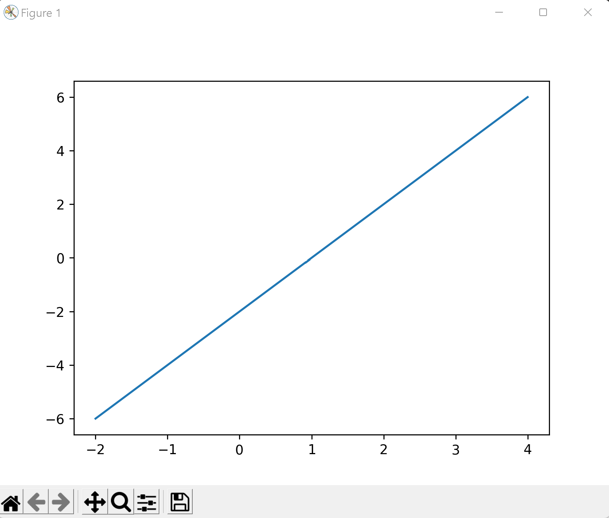
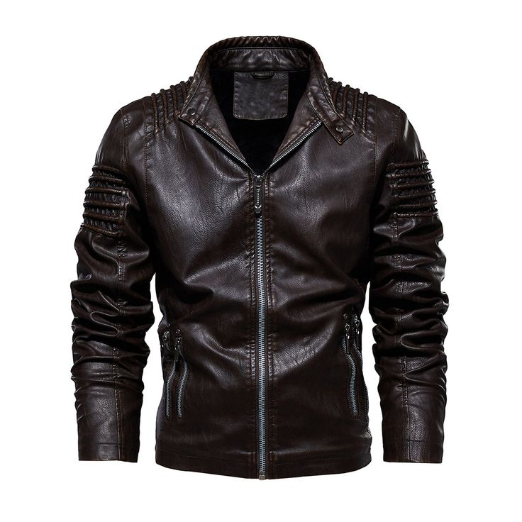
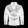

# Lab 11 Report - TensorFlow Lab

## Checkpoint 1: Verify Your TensorFlow

## Checkpoint 2: Run a TensorFlow classification

## Checkpoint 3: Curate some data
### Original Images

### Formatted Images

### Results

The classifier was not able to classify the shoes correctly and thought they were a bag. This could be due to the orignal image being too small and not having enough data when being formatted even smaller.
